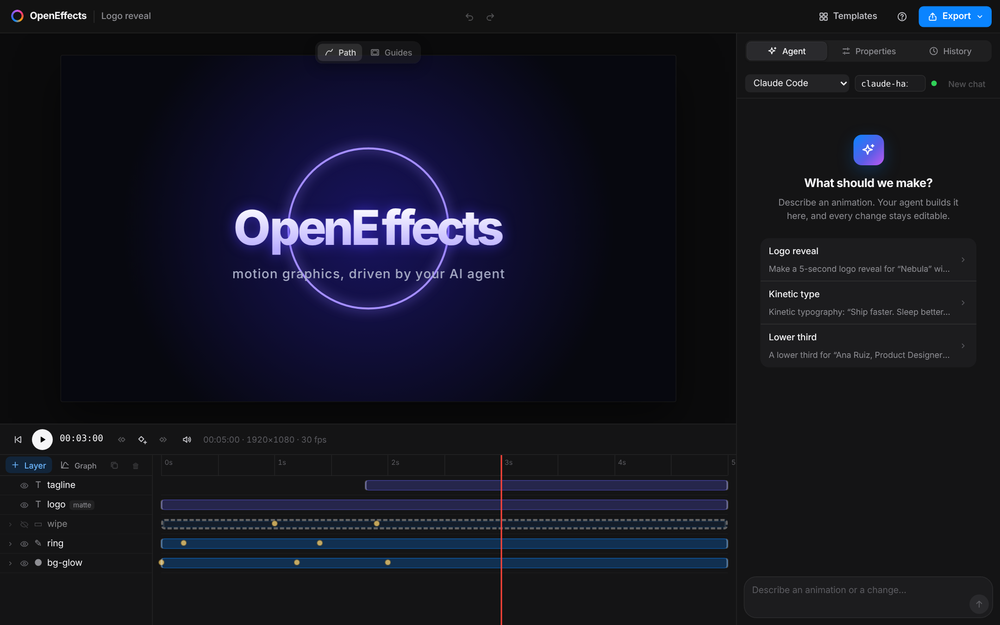
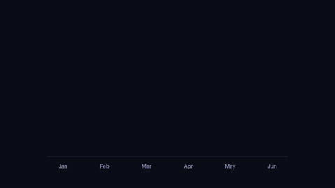

# OpenEffects

**Open-source motion graphics, driven by the AI agent you already use.**

Describe an animation, and your coding agent (Claude Code, Codex or OpenCode with any model, including
free and local ones) builds it on a real timeline while you watch the preview update live. Then tweak any
keyframe by hand, undo any AI turn, and export to MP4, GIF, WebM or ProRes.


*The animation above was made by Claude Code in OpenEffects from a single prompt (29 seconds, $0.25), see [examples/nebula](examples/nebula).*



## Gallery: one prompt each, on the cheapest model

All five were made with **Claude Haiku 5.5**, for **about 7 cents in total**: one `oe ask` command each, no hand edits.
The prompts are in [examples/](examples).

| | | |
|---|---|---|
| <br>Kinetic typography · 29 s · $0.014 | <br>Broadcast lower third · 53 s · $0.018 | <br>Vertical social ad · 45 s · $0.013 |
| <br>Animated chart · 50 s · $0.015 | <br>Seamless loop · 21 s · $0.007 | [examples/showreel](examples/showreel) nests all of them as precomps into a 40 s reel, built in OpenEffects itself |

## Why OpenEffects

- **Bring your own agent.** Like [T3 Code](https://github.com/pingdotgg/t3code), OpenEffects runs the agent
  CLI you already have installed and signed in to: Claude Code, Codex or OpenCode. No extra account, no API
  key, no AI bill from us. Pick any model; cheap ones like Claude Haiku 5.5 work well (cents per animation).
- **Agents can see their own work.** The MCP server renders frames and contact sheets back to the agent,
  so it checks for clipping, overlaps and timing and fixes them before it says it's done.
- **Projects are plain JSON + git.** One readable `project.oe.json` per project, validated by a strict
  schema with precise error messages. Every agent turn is checkpointed (hidden git refs) and can be undone.
- **Works from the terminal too.** Every project folder has an `AGENTS.md` guide and a `.mcp.json`, so
  `cd my-project && claude` just works, as does any other MCP-capable agent.

## Quick start

Requirements: Node 20+, [pnpm](https://pnpm.io), [ffmpeg](https://ffmpeg.org) (for video export) and at
least one agent CLI installed and logged in (see [Agents](#agents)).

```bash
git clone https://github.com/PrisacariuRobert/OpenEffects && cd OpenEffects
pnpm install
pnpm build:web

pnpm oe init ~/my-first-animation      # create a project
pnpm oe dev ~/my-first-animation       # open http://127.0.0.1:4310
```

Type what you want in the **Agent** panel, e.g. *"Make a 5-second logo reveal for 'Nebula' with a glowing
ring that draws on"*. Pick the agent and model at the top of the panel.

Or skip the editor entirely:

```bash
pnpm oe ask ~/my-first-animation "Kinetic typography: 'Ship faster. Sleep better.' word by word"
pnpm oe render ~/my-first-animation --format mp4
```

## Agents

| Agent | Set up once | Models | How OpenEffects connects |
|---|---|---|---|
| **Claude Code** | `claude` (log in) | Haiku 5.5 (default, cheapest), Sonnet 5.5, Opus 5.5 | `claude -p --output-format stream-json` with the MCP server passed via `--mcp-config` |
| **Codex** | `npm i -g @openai/codex && codex login` | your Codex default, or any `-m` model | `codex exec --json` (resumes with `exec resume`), MCP server injected with `-c mcp_servers.*` |
| **OpenCode** | `npm i -g opencode-ai && opencode auth login` | anything OpenCode supports: free models, Ollama/LM Studio local models, 75+ providers | `opencode run --format json`, MCP server injected via `OPENCODE_CONFIG_CONTENT` |

Your own CLI config and login are used untouched; OpenEffects only adds its MCP server for the duration of
a turn. Switching agents starts a fresh conversation; the project and its undo history stay.

### CLI

| Command | What it does |
|---|---|
| `oe init [dir]` | New project: `project.oe.json`, `AGENTS.md`, `.mcp.json`, git repo |
| `oe dev [dir]` | Editor with live preview, timeline, agent panel, history (`--port`) |
| `oe ask [dir] "<prompt>"` | Let an agent edit the project from the terminal (`--agent claude\|codex\|opencode --model <id> --new`) |
| `oe render [dir]` | Export (`--format mp4\|webm\|gif\|mov\|png --out file --scale 0.5`) |
| `oe frame [dir] --time 2` | Render one frame to PNG |
| `oe sheet [dir]` | Contact sheet of the whole animation |
| `oe validate [dir]` | Check the project file |
| `oe mcp [dir]` | OpenEffects MCP server on stdio |

(Run them as `pnpm oe …` from the repo until the npm package is published.)

### Using other agents

Any MCP client can drive OpenEffects. Point it at `oe mcp <project-dir>`, e.g. for Claude Desktop or Cursor:

```json
{
  "mcpServers": {
    "openeffects": { "command": "pnpm", "args": ["--silent", "--dir", "/path/to/OpenEffects", "oe", "mcp", "/path/to/project"] }
  }
}
```

## How it works

```
 Browser editor (React)  ◄── WebSocket: live project, agent events, checkpoints ──┐
   preview · timeline · agent chat · inspector · history                         │
                                                                                  │
 oe dev (Node server) ────────────────────────────────────────────────────────────┘
   ├─ watches project.oe.json → hot reload
   ├─ agent adapters: spawn YOUR claude / codex / opencode CLI, normalize their JSON events
   ├─ checkpoints: git snapshot before/after every turn (private index, hidden refs)
   └─ export: same engine, headless (@napi-rs/canvas) → ffmpeg
          │
          ▼  the agent connects to …
 oe mcp (MCP server): oe_get_project · oe_add_layer · oe_update_layer · oe_set_keyframes ·
                      oe_render_frame · oe_render_contact_sheet · oe_export · …
```

| Package | Role |
|---|---|
| `packages/schema` | Project format (Zod), keyframe interpolation, easings, edit operations, agent guide, wire contracts |
| `packages/engine` | Deterministic renderer: `renderFrame(ctx, project, { time })` on any Canvas 2D (browser or Node) |
| `packages/node` | Headless rendering, contact sheets, ffmpeg export, project I/O |
| `packages/mcp` | The OpenEffects MCP server |
| `apps/server` | Local server: hot reload, agent adapters, checkpoints, export jobs |
| `apps/web` | The editor UI |
| `apps/cli` | The `oe` command |

### What the engine supports today

Layers: solid, rect, ellipse, SVG path (with trim paths), text, image, null (parenting), nested compositions.
Animation: keyframes on any property with 30+ easings or cubic-bezier, per-character/word/line text animators.
Compositing: blend modes, track mattes, parenting. Effects: blur, glow, drop shadow, color adjust.
Export: MP4 (H.264), WebM (VP9 with alpha), MOV (ProRes 4444 with alpha), GIF, PNG sequence.

The format is documented for agents in [`AGENTS.md`](packages/schema/src/guide.ts), and as a JSON Schema in
[`schema/project.schema.json`](schema/project.schema.json) for editor autocomplete.

## Status and roadmap

This is an early prototype (Phase 0 of the [plan](docs/PLAN.md)). Next up:

- [x] Claude Code, Codex and OpenCode adapters, model picker (cheap models by default), `oe ask`
- [ ] Gemini CLI adapter; a Codex `app-server` adapter for live streaming
- [ ] Desktop app (Electron/Tauri) and `npx openeffects` packaging
- [ ] Direct manipulation in the viewport, graph editor, video layers, audio
- [ ] WebGPU renderer, shader effect plugins, Lottie import/export
- [ ] Template gallery

## Contributing

Contributions are welcome, especially new effects, easings, templates and agent adapters. See [CONTRIBUTING.md](CONTRIBUTING.md).

## Credits

The agent architecture is modeled on [T3 Code](https://github.com/pingdotgg/t3code) by Ping Labs (MIT): a local
server that runs the user's own agent CLIs and turns their output into provider-neutral events, with
per-turn git checkpoints. OpenEffects is not affiliated with Adobe; After Effects is a trademark of Adobe Inc.

## License

[MIT](LICENSE)
