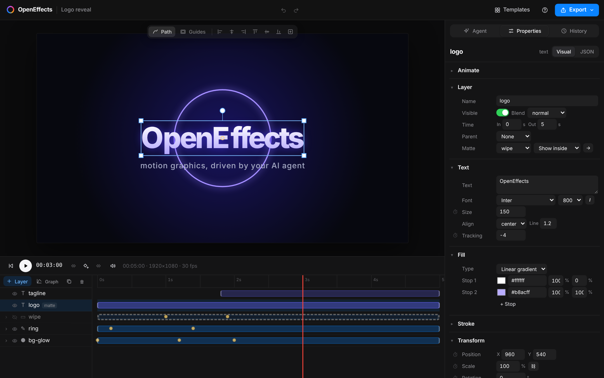
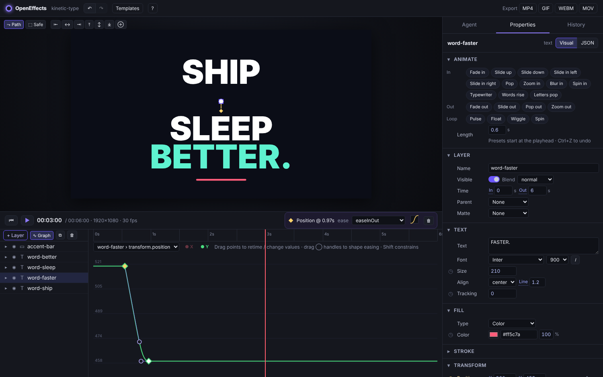
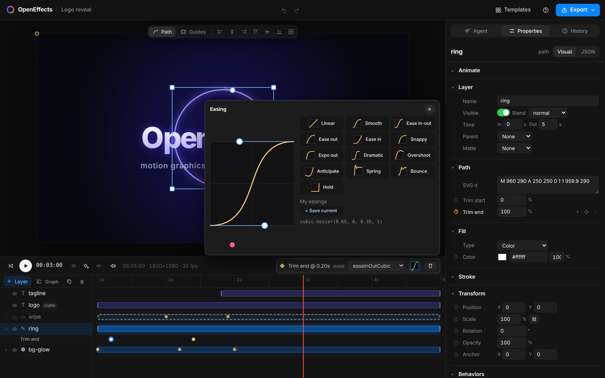
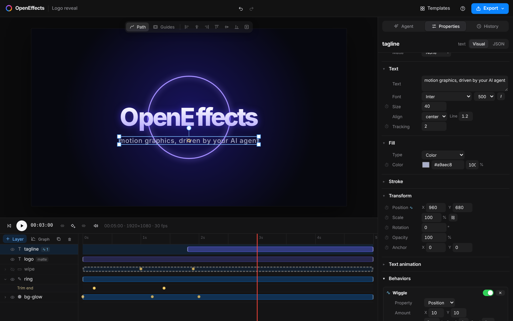
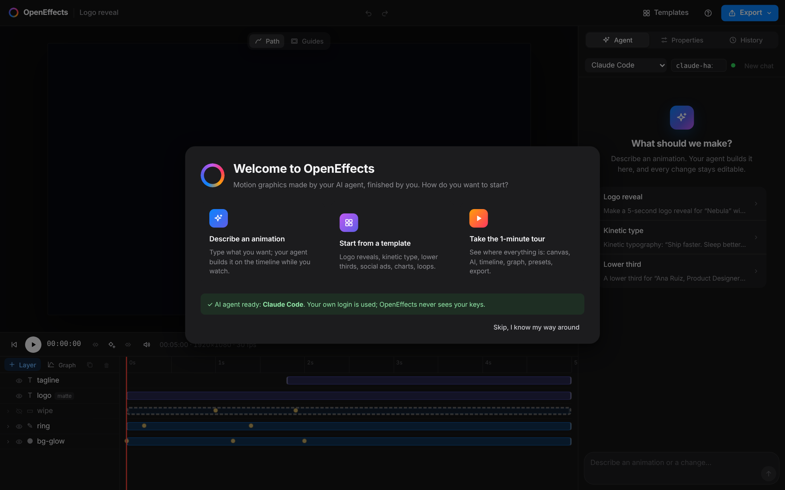
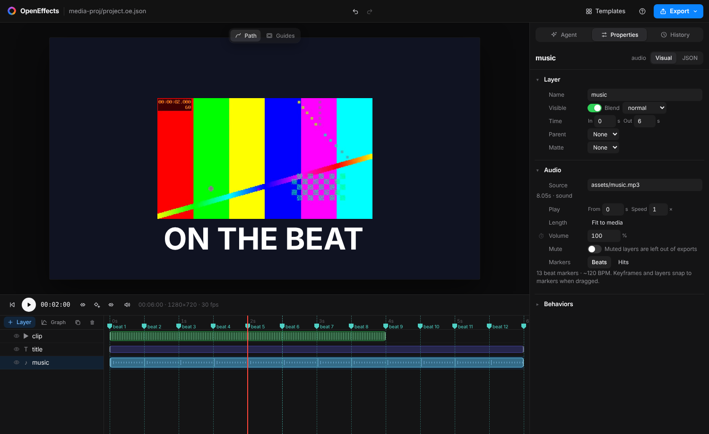

# OpenEffects

**The open-source alternative to Claude Motion. Motion graphics made by the AI agent you already use, finished by you.**

Describe an animation, and your coding agent (Claude Code, Codex or OpenCode with any model, including
free and local ones) builds it on a real timeline while you watch the preview update live. Then tweak any
keyframe by hand, undo any AI turn, and export to MP4, ProRes, WebM, GIF or Lottie. Free, MIT-licensed,
and it runs on your machine.

Created and maintained by [@PrisacariuRobert](https://github.com/PrisacariuRobert).


*The OpenEffects launch reel, made entirely in OpenEffects: 10 compositions, 145 layers, an original soundtrack and
scene cuts on its beat markers, with a 16:9 and a 9:16 cut from one project. Watch it with sound:
[16:9 MP4](site/media/launch.mp4) · [9:16 MP4](site/media/launch-vertical.mp4) · the end card as
[Lottie JSON](site/media/end-card.json) · project in [examples/launch-reel](examples/launch-reel). A landing page
built around it is in [site/](site/index.html).*


*This logo reveal was made by Claude Code in OpenEffects from a single prompt (29 seconds, $0.25), see [examples/nebula](examples/nebula).*


## OpenEffects vs Claude Motion

[Claude Motion](https://support.claude.com/en/articles/17454997-get-started-with-claude-motion) (Anthropic,
beta since October 2026) showed that the right way to make motion graphics with AI is code, not
generated video: every frame stays exact, and you can change one word without re-rolling the whole clip.
OpenEffects agrees, and takes it to everyone, in the open:

| | **OpenEffects** | **Claude Motion** |
|---|---|---|
| Price and plans | Free and open source (MIT) | Included in Claude Team and Enterprise plans (beta); not on Free, Pro or Max |
| AI | Your choice: Claude Code, Codex, OpenCode (incl. free and local models), any MCP client | Claude |
| Where it runs | On your machine; projects are plain JSON files in your own git repo | Inside Claude |
| Editing | Prompts **and** a full editor: timeline, keyframes, graph and ease editors, direct manipulation | By asking Claude (each animation is code, so one detail can change without redoing the rest) |
| Export | MP4, ProRes 4444 and WebM with transparency, GIF, PNG sequence, **Lottie** | MP4 |
| Import | Lottie files become editable layers; images, video and audio | The content you share with Claude |
| Extend it | Fork it, script it (`oe` CLI), drive it from any agent via MCP | Through Claude |

*Claude Motion facts are from Anthropic's help center and pricing pages as of October 2026; check them for
updates. Already pay for Claude? OpenEffects runs on your Claude Code login, so you can use both.*

## Gallery: one prompt each, on the cheapest model

All five were made with **Claude Haiku 5.5**, for **about 7 cents in total**: one `oe ask` command each, no hand edits.
The prompts are in [examples/](examples).

| | | |
|---|---|---|
| <br>Kinetic typography · 29 s · $0.014 | <br>Broadcast lower third · 53 s · $0.018 | <br>Vertical social ad · 45 s · $0.013 |
| <br>Animated chart · 50 s · $0.015 | <br>Seamless loop · 21 s · $0.007 | [examples/showreel](examples/showreel) nests all of them as precomps into a 40 s reel, built in OpenEffects itself |

## New: versions, captions, brand kits, batches and references

Each of these was made by **Claude Sonnet 5.5** from one `oe ask` command (the prompts are in [examples/](examples)).

| | |
|---|---|
| <br>**4 versions at once.** One prompt, four creative directions (bold, calm, playful, cinematic) made in parallel and previewed live side by side. Pick one and keep editing. `oe ask --variations 4` · 36 s · $0.98 for all four · [examples/logo-variations](examples/logo-variations) | <br>**Reference → animation.** Attach an image or a clip and the agent takes after its palette, type and layout (clips are read as a timed contact sheet, so motion carries over too). Left: the reference. Right: the result. `oe ask --ref poster.png` · 47 s · $0.33 · [examples/reference-title](examples/reference-title) |
| <br>**Word-by-word captions** from an SRT/VTT file, or transcribed locally with whisper.cpp. Pop, karaoke and minimal styles, timed to each spoken word, lines balanced so no word is left alone. `oe_add_captions` · 2 turns, 85 s · $1.25 · [examples/captions-clip](examples/captions-clip) | <br>**Brand kit + data batch.** The agent designs with your `brand.json` (colors, fonts, logo, voice) and leaves `{{name}}`-style fields, then `oe batch --data team.csv` renders one video per row: 3 videos in 9 s. Agent turn: 26 s · $0.25 · [examples/team-welcome](examples/team-welcome) |

**Review what the agent changed.** After each turn, the agent panel lists every layer and property it added,
removed or changed, the timeline marks those layers, and any single layer can be reverted without undoing the rest.

## You stay in control

The agent does the heavy lifting; you direct and fine-tune it like in any motion design tool.



- **Direct manipulation:** click a layer in the viewer to select it, drag to move, corners to scale, the top handle
  to rotate (Shift snaps, layers snap to the center lines). On animated properties this sets a keyframe at the playhead.
- **Properties panel:** every property has a real control: drag-to-scrub numbers, color pickers, gradients, fonts,
  effects, text animators, parenting and mattes. ◷ animates a property, ◆ adds a keyframe, ‹ › jumps between keyframes.
- **Timeline:** drag layers in time, trim their in/out points, reorder by dragging, hide/show, twirl down to see each
  animated property, drag keyframes to retime them. Keyframe shapes show their easing (◆ linear, ● eased, pink = overshoot,
  ■ hold). Shift-click to select several, Ctrl+C / Ctrl+V to copy them to another layer at the playhead, B / N to set a
  preview loop range.
- **Graph editor** (∿ Graph): the value curves of a property; drag keyframes in time and value and drag bezier handles to
  shape the motion, After Effects-style. Constant dimensions are hidden so small moves stay readable.
- **Ease editor:** click the curve in the keyframe bar for a bezier editor with a live preview, presets from Smooth and
  Snappy to Overshoot, Anticipate, Spring and Bounce, and your own saved "My easings".
- **Animate presets:** one click for fade, slide, pop, zoom, blur, spin, typewriter / words rise / letters pop (in and out),
  and pulse, float, wiggle and spin loops. They write normal keyframes, so everything stays editable, and agents can use
  the same presets (`oe_apply_preset`).
- **Behaviors:** procedural motion attached to any property, no keyframes needed: **wiggle** (organic noise),
  **oscillate** (sine/triangle/square/saw for pulse, float, sway), **drift** (spin, slow pans), **loop** (repeat keyframes,
  cycle or ping-pong) and **follow** (trail another layer with a delay). Each has a time window and fade-in, and agents
  can add them too (`oe_add_behavior`).
- **Video, audio and markers:** drop video (MP4, WebM, MOV) and audio (MP3, WAV, M4A, OGG, FLAC) onto the viewer.
  Media layers have trim, speed, loop, keyframable volume and mute, waveforms in the timeline and sound in the preview;
  exports mix every audio track in. Press **M** for a marker at the playhead (drag, rename, `[` / `]` to jump), or
  **◆ Beats / ◆ Hits** on a music layer to drop a marker on every beat; layer, trim and keyframe drags snap to markers,
  so cutting to the music is drag-and-drop. Agents can do the same (`oe_detect_beats`) and time animations to the beat.
- **Lottie in and out:** export any composition as a Lottie JSON for websites and iOS/Android apps
  (keyframes and easing carry over; behaviors and text animators are baked), or drop a Lottie file onto the
  viewer to get editable layers: shape layers become rects, ellipses and paths, with path morphing, curved
  motion, masks, mattes, text and precomps with time remapping. Checked against lottie-web: exports render
  the same as in OpenEffects, and real After Effects exports import within a few percent of lottie-web.
- **Viewer aids:** motion paths for animated positions, align to frame (left/center/right/top/middle/bottom),
  title/action-safe guides.
- **Ask the AI about the selection:** with a layer selected, requests apply to it ("make it bouncier") and one-click
  quick asks are offered. The agent only touches what you pointed at.
- **Undo everything:** Ctrl+Z / Ctrl+Shift+Z for your edits *and* the agent's; per-turn checkpoints in History.
- **Start fast:** a welcome screen on first launch (describe an animation, pick a template, or take a 1-minute spotlight
  tour of the editor; it also checks your AI agent is set up), a template gallery with live previews, drag & drop media,
  `?` for all shortcuts and to replay the tour.

| Graph editor | Ease editor |
|---|---|
|  |  |
| **Behaviors** | **First run** |
|  |  |



What to build was decided by a short [UX research study](docs/RESEARCH.md) of Jitter, Cavalry, Lottie Creator, After
Effects and AI motion tools.

## Why OpenEffects

- **Bring your own agent.** Like [T3 Code](https://github.com/pingdotgg/t3code), OpenEffects runs the agent
  CLI you already have installed and signed in to: Claude Code, Codex or OpenCode. No extra account, no API
  key, no AI bill from us. Pick any model; cheap ones like Claude Haiku 5.5 work well (cents per animation).
- **Agents can see their own work.** The MCP server renders frames and contact sheets back to the agent,
  so it checks for clipping, overlaps and timing and fixes them before it says it's done.
- **Projects are plain JSON + git.** One readable `project.oe.json` per project, validated by a strict
  schema with precise error messages. Every agent turn is checkpointed (hidden git refs) and can be undone.
- **Works from the terminal too.** Every project folder has an `AGENTS.md` guide and a `.mcp.json`, so
  `cd my-project && claude` just works, as does any other MCP-capable agent.

## Quick start

Requirements: Node 20+, [ffmpeg](https://ffmpeg.org) (for video export) and at least one agent CLI installed
and logged in (see [Agents](#agents)).

```bash
npx openeffects app my-first-animation
```

That's the whole install: it creates the project and opens the editor in its own window (a chromeless
Chrome, Edge or Brave window, so no 150 MB Electron download; it falls back to your default browser).
Closing the window quits. In Chrome or Edge you can also install it as an app from the address bar.
*The npm package is ready but not published yet; until it is, run it from source:*

```bash
git clone https://github.com/PrisacariuRobert/OpenEffects && cd OpenEffects
pnpm install
pnpm build:web

pnpm oe app ~/my-first-animation       # create the project and open the editor
```

Type what you want in the **Agent** panel, e.g. *"Make a 5-second logo reveal for 'Nebula' with a glowing
ring that draws on"*. Pick the agent and model at the top of the panel.

Or skip the editor entirely:

```bash
pnpm oe ask ~/my-first-animation "Kinetic typography: 'Ship faster. Sleep better.' word by word"
pnpm oe render ~/my-first-animation --format mp4
```

## Agents

| Agent | Set up once | Models | How OpenEffects connects |
|---|---|---|---|
| **Claude Code** | `claude` (log in) | Haiku 5.5 (default, cheapest), Sonnet 5.5, Opus 5.5 | `claude -p --output-format stream-json` with the MCP server passed via `--mcp-config` |
| **Codex** | `npm i -g @openai/codex && codex login` | your Codex default, or any `-m` model | `codex exec --json` (resumes with `exec resume`), MCP server injected with `-c mcp_servers.*` |
| **OpenCode** | `npm i -g opencode-ai && opencode auth login` | anything OpenCode supports: free models, Ollama/LM Studio local models, 75+ providers | `opencode run --format json`, MCP server injected via `OPENCODE_CONFIG_CONTENT` |

Your own CLI config and login are used untouched; OpenEffects only adds its MCP server for the duration of
a turn. Switching agents starts a fresh conversation; the project and its undo history stay.

### CLI

| Command | What it does |
|---|---|
| `oe app [dir]` | Open the editor in its own window, creating the project if needed |
| `oe init [dir]` | New project: `project.oe.json`, `AGENTS.md`, `.mcp.json`, git repo |
| `oe dev [dir]` | Editor server only; open the printed URL (`--port`) |
| `oe ask [dir] "<prompt>"` | Let an agent edit the project from the terminal (`--agent claude\|codex\|opencode --model <id> --new`) |
| `oe ask … --variations 4` | Several versions in parallel, each with its own creative direction, saved in `variations/` |
| `oe ask … --ref file` | Take after a reference image or clip |
| `oe render [dir]` | Export (`--format mp4\|webm\|gif\|mov\|png\|lottie --out file --scale 0.5`) |
| `oe batch [dir] --data rows.csv` | One video per CSV row, filling `{{column}}` placeholders (`--format --name "{{name}}" --out`) |
| `oe captions [dir] --from file` | Word-by-word captions from `.srt`/`.vtt`, or transcribe audio/video with local whisper.cpp (`--style pop\|karaoke\|minimal`) |
| `oe import <file.json> [dir]` | Import a Lottie file: a new project, or a precomp layer in an existing one (`--replace`) |
| `oe frame [dir] --time 2` | Render one frame to PNG |
| `oe sheet [dir]` | Contact sheet of the whole animation |
| `oe validate [dir]` | Check the project file |
| `oe mcp [dir]` | OpenEffects MCP server on stdio |

(Run them as `npx openeffects …` once the package is published, or `pnpm oe …` from the repo.)

Captions from audio need [whisper.cpp](https://github.com/ggml-org/whisper.cpp) (`whisper-cli` on your PATH, or
`OE_WHISPER=/path/to/whisper-cli`) and a model at `~/.cache/openeffects/ggml-base.en.bin` (or `OE_WHISPER_MODEL`).
Everything runs on your machine; subtitle files need nothing extra.

### Using other agents

Any MCP client can drive OpenEffects. Point it at `oe mcp <project-dir>`, e.g. for Claude Desktop or Cursor:

```json
{
  "mcpServers": {
    "openeffects": { "command": "npx", "args": ["-y", "openeffects", "mcp", "/path/to/project"] }
  }
}
```

From a clone, use `"command": "pnpm", "args": ["--silent", "--dir", "/path/to/OpenEffects", "oe", "mcp", "/path/to/project"]`.
The server is described for the [MCP registry](https://registry.modelcontextprotocol.io) in [`server.json`](server.json).

## How it works

```
 Browser editor (React)  ◄── WebSocket: live project, agent events, checkpoints ──┐
   preview · timeline · agent chat · inspector · history                         │
                                                                                  │
 oe dev (Node server) ────────────────────────────────────────────────────────────┘
   ├─ watches project.oe.json → hot reload
   ├─ agent adapters: spawn YOUR claude / codex / opencode CLI, normalize their JSON events
   ├─ checkpoints: git snapshot before/after every turn (private index, hidden refs)
   └─ export: same engine, headless (@napi-rs/canvas) → ffmpeg
          │
          ▼  the agent connects to …
 oe mcp (MCP server): oe_get_project · oe_add_layer · oe_update_layer · oe_set_keyframes ·
                      oe_render_frame · oe_render_contact_sheet · oe_export · …
```

| Package | Role |
|---|---|
| `packages/schema` | Project format (Zod), keyframe interpolation, easings, edit operations, agent guide, wire contracts |
| `packages/engine` | Deterministic renderer: `renderFrame(ctx, project, { time })` on any Canvas 2D (browser or Node) |
| `packages/node` | Headless rendering, contact sheets, ffmpeg export, project I/O |
| `packages/lottie` | Lottie import and export (bodymovin 5.x JSON ⇄ projects) |
| `packages/mcp` | The OpenEffects MCP server |
| `apps/server` | Local server: hot reload, agent adapters, checkpoints, export jobs |
| `apps/web` | The editor UI |
| `apps/cli` | The `oe` command |

### What the engine supports today

Layers: solid, rect, ellipse, SVG path (with trim paths and shape morphing), text, image, video, audio, null (parenting),
nested compositions (with time remapping).
Media: trim, speed, loop, keyframed volume, mute; composition markers; beat/onset detection.
Animation: keyframes on any property with 30+ easings or cubic-bezier, per-character/word/line text animators.
Compositing: blend modes, track mattes, parenting. Effects: blur, glow, drop shadow, color adjust.
Export: MP4 (H.264 + AAC), WebM (VP9 with alpha + Opus), MOV (ProRes 4444 with alpha + PCM), GIF, PNG sequence, Lottie JSON.
Import: Lottie JSON (After Effects/bodymovin, LottieFiles), images, video, audio.

The format is documented for agents in [`AGENTS.md`](packages/schema/src/guide.ts), and as a JSON Schema in
[`schema/project.schema.json`](schema/project.schema.json) for editor autocomplete.

## Status and roadmap

This is an early prototype (Phase 0 of the [plan](docs/PLAN.md)). Next up:

- [x] Claude Code, Codex and OpenCode adapters, model picker (cheap models by default), `oe ask`
- [ ] Gemini CLI adapter; a Codex `app-server` adapter for live streaming
- [x] `npx openeffects` package and an app window (`oe app`), installable as a PWA
- [x] Variations, reference → animation, captions, brand kits and CSV batches, per-layer review of agent changes
- [ ] Native desktop builds (Tauri)
- [x] Direct manipulation, visual properties panel, keyframe/easing editing, undo/redo, templates, image drop
- [x] Graph editor, ease editor with saved easings, animate presets, keyframe multi-select/copy/paste, motion paths, align, safe guides, loop range ([research](docs/RESEARCH.md))
- [x] Behaviors (wiggle, oscillate, drift, loop, follow) and a first-run welcome + guided tour
- [x] Video and audio layers, waveforms, audio in previews and exports, markers with beat detection and snapping
- [x] Lottie import and export, path morphing, time remapping, calmer redesigned interface
- [ ] Figma import, Lottie merge paths and repeaters, embedded Lottie fonts
- [ ] WebGPU renderer, shader effect plugins
- [ ] Template gallery

## Contributing

Contributions are welcome, especially new effects, easings, templates and agent adapters. See [CONTRIBUTING.md](CONTRIBUTING.md).
The release and launch checklist is in [docs/LAUNCH.md](docs/LAUNCH.md).

## Author

OpenEffects is created and maintained by **[@PrisacariuRobert](https://github.com/PrisacariuRobert)**.
Issues, ideas and pull requests are welcome.

## Credits

The agent architecture is modeled on [T3 Code](https://github.com/pingdotgg/t3code) by Ping Labs (MIT): a local
server that runs the user's own agent CLIs and turns their output into provider-neutral events, with
per-turn git checkpoints. OpenEffects is an independent project, not affiliated with Anthropic or Adobe. Claude and
Claude Motion are trademarks of Anthropic; After Effects is a trademark of Adobe Inc.; Lottie is a format
originally created by Airbnb.

## License

[MIT](LICENSE)
